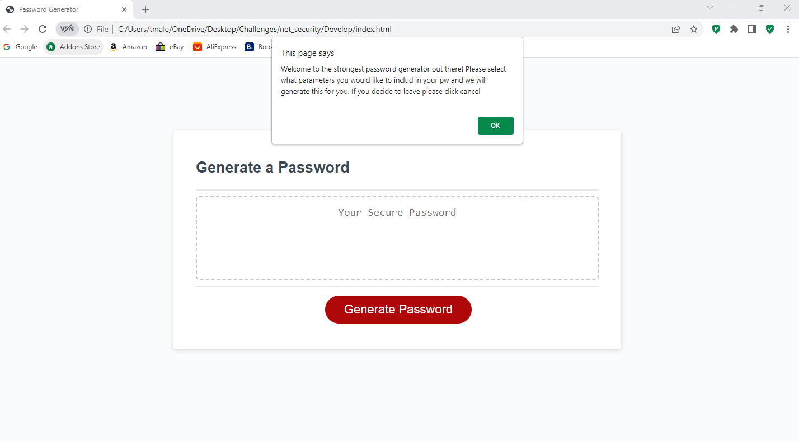
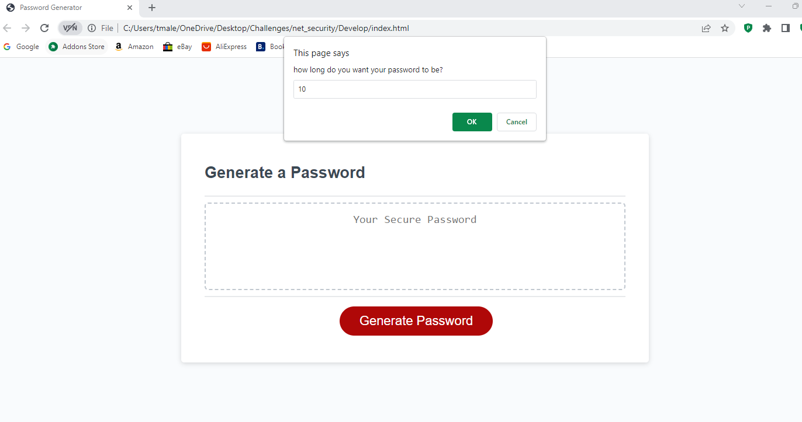
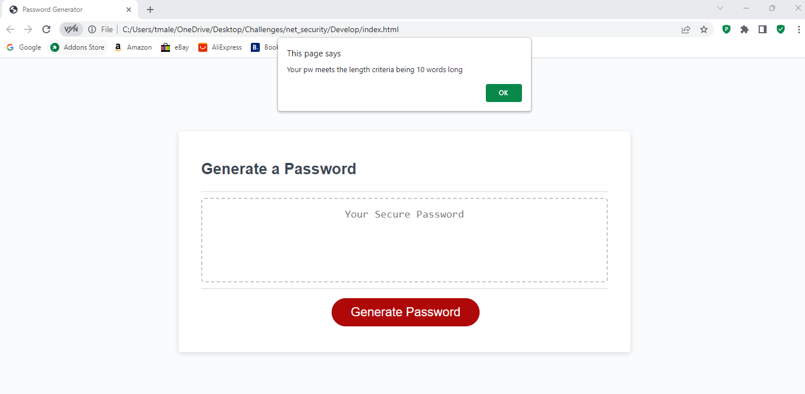
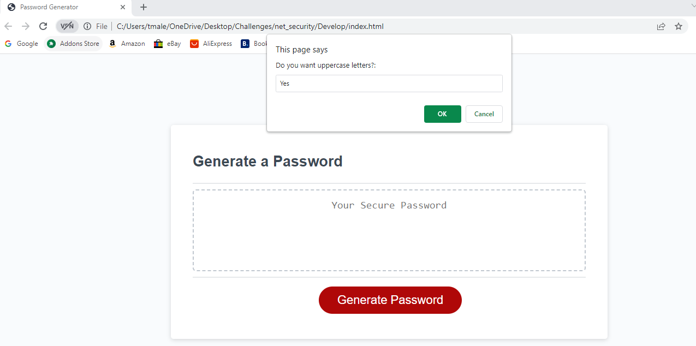
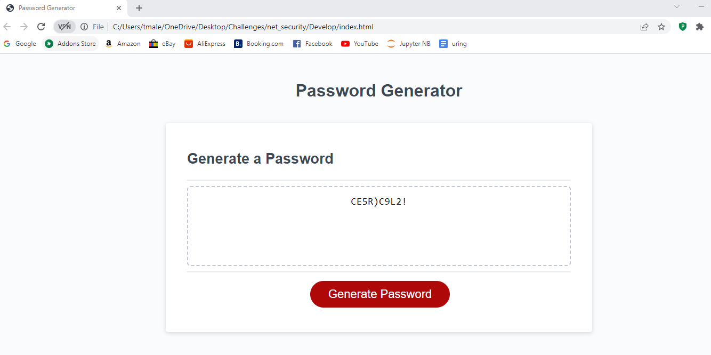

# net_security
## Description

As internet security is paramount in this day and age, this is an application to generate a random password. It takes in user input, allowing the user to chose what specifications they would like their password to adhere to e.g. whether to include special characters or numbers. Once the user has selected the length of their password (not less than 8 and not more than 128) along with other parameters to include, the application will generate a random password for the user incorporating all their selected specifications.

## Installation

N/A

## Usage

- The user will open the page and click on the "generate password" button.
- User will be given a message welcoming them to the application 
- User will be prompted to select the length of a password betweeen the given parameters.
- If the user selection is valid they will receive a message letting them know that the entry has been approved 
- An acceptance message will be given with all relevant criteria met
- The user will then be prompted to select whether they would like to include uppercase, lowercase, special characters or numbers in their password 
- Once selected the application will create a random password based on the user input 

## License

Please refer to LICENSE in the repo

